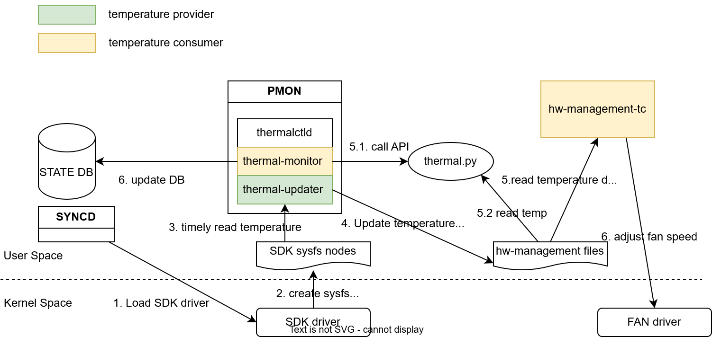

# Improve SONiC Thermal Algorithm

*High Level Design*

Rev. 0.1

## Table of Contents

- [1. General Information](#1-general-information)
  - [1.1 Revision](#11-revision)
  - [1.2 About this Manual](#12-about-this-manual)
  - [1.3 Scope](#13-scope)
  - [1.4 Definitions/Abbreviation](#14-definitionsabbreviation)
  - [1.5 Reference](#15-reference)
- [2. Overview](#2-overview)
- [3. Requirements](#3-requirements)
- [4. Architecture Design](#4-architecture-design)
- [5. High Level Design](#5-high-level-design)
  - [5.1 thermal-updater change](#51-thermal-updater-change)
  - [5.2 thermal.py change](#52-thermalpy-change)
  - [5.3 hw-management-sync change](#53-hw-management-sync-change)
    - [5.3.1 Prevent thermal-updater from accessing temperature sysfs nodes when they are unavailable](#531-prevent-thermal-updater-from-accessing-temperature-sysfs-nodes-when-they-are-unavailable)
      - [Option 1: wait temperature sysfs nodes existence before accessing it](#option-1-wait-temperature-sysfs-nodes-existence-before-accessing-it)
      - [Option 2: SDK driver udev event](#option-2-sdk-driver-udev-event)
  - [5.4 SAI API](#54-sai-api)
  - [5.5 Configuration and management](#55-configuration-and-management)
    - [5.5.1 Manifest (if the feature is an Application Extension)](#551-manifest-if-the-feature-is-an-application-extension)
    - [5.5.2 CLI/YANG model Enhancements](#552-cliyang-model-enhancements)
    - [5.5.3 Config DB Enhancements](#553-config-db-enhancements)
  - [5.6 Warmboot and Fastboot Design Impact](#56-warmboot-and-fastboot-design-impact)
  - [5.7 Warmboot and Fastboot Performance Impact](#57-warmboot-and-fastboot-performance-impact)
  - [5.8 Memory Consumption](#58-memory-consumption)
  - [5.9 Restrictions/Limitations](#59-restrictionslimitations)
- [6. Testing Requirements/Design](#6-testing-requirementsdesign)
  - [6.1 Unit Test cases](#61-unit-test-cases)
  - [6.2 System Test cases](#62-system-test-cases)

## 1. General Information

### 1.1 Revision

**Table 1 Revision**

| Rev | Date | Author | Change Description |
| --- | --- | --- | --- |
| 1.0 |  | Junchao Chen | Base version |

### 1.2 About this Manual

This document provides general information about the SONiC thermal algorithm change according to the requirement from MSFT.

### 1.3 Scope

This document outlines an enhancement to the SONiC thermal algorithm for the NVIDIA platform. The primary focus of this improvement is on air-cooled systems, with liquid cooling systems excluded from the scope. The enhancement centers on ASIC, module temperature data, while other thermal sensors are not included.

### 1.4 Definitions/Abbreviation

N/A

### 1.5 Reference

N/A

## 2. Overview

The current SONiC thermal algorithm comprises several key components:

- `hw-management-sync`: This service provides temperature data for ASIC and firmware-controlled modules.
- `thermal-updater`: Operating as a thread within `thermalctld`, it supplies temperature data for software-controlled modules and DPUs (smart switch only).
- `thermal-monitor`: Functioning as a thread inside `thermalctld`, it collects temperature data from all thermal sensors and stores it in the database. The SONiC CLI accesses this data from the database to present it to users.
- `hw-management-tc`: This service performs thermal actions, such as adjusting fan speed, based on temperature data changes.
- `SDK driver`: Providing sysfs nodes for SONiC to accessing ASIC and module temperature data.

This document outlines improvements to the current SONiC thermal algorithm in the following areas:

- A single temperature provider will be implemented to prevent multiple providers from interfering with each other. The `hw-management-sync` will be disabled, making the `thermal-updater` the sole temperature provider responsible for supplying temperature data for ASIC, modules (both software-controlled and firmware-controlled), and DPUs.
- A single temperature data source will be used to minimize I2C bus access. The `thermal-updater` will access the I2C bus to collect temperature data for ASIC and modules and update this data to the `hw-management` files. The `thermal-monitor` will then retrieve ASIC and module temperature data from the `hw-management` files, rather than directly accessing the I2C bus.
- Implement a robust mechanism to prevent `thermal-updater` from accessing temperature sysfs nodes when they are unavailable.

## 3. Requirements

- Single temperature provider
- Single temperature data source
- Avoid accessing temperature sysfs nodes when they are unavailable

## 4. Architecture Design

This enhancement does not change existing SONiC architecture. The feature architecture is described in below chart:



1. `syncd` container startup script load SDK drivers
2. SDK driver creates ASIC and module temperature sysfs nodes
3. `thermal-updater` timely reads temperature data from sysfs nodes
4. `thermal-updater` timely updates temperature data to `hw-management` files
5. `hw-management-tc` timely reads temperature data from `hw-management` files and adjust fan speed accordingly
6. `thermal-monitor` timely reads temperature data from `hw-management` files and update DB

The shutdown flow is described below:

1. User issues `config reload` or warmboot or fastboot
2. `pmon` start to shutdown
3. `thermal-monitor` shutdown (ensure `thermal-monitor` is stopped before `thermal-updater`)
4. `thermal-updater` suspends `hw-management-tc` and shutdown
5. `syncd` is stopped and unload SDK drivers

## 5. High Level Design

### 5.1 thermal-updater change

Current behavior:

- It runs when module host management mode is enabled.
- It only collect temperature data for software-controlled modules.
- It reads temperature update interval from `tc_config.json` and halves the value.

Updated behavior:

- It runs always
- It collect temperature data from ASIC, software-controlled modules and firmware-controlled modules.
- ASIC: read from SDK sysfs `/sys/module/sx_core/asic0/temperature/*`
- software-controlled modules: read from module EEPROM which is also provided by SDK sysfs `/sys/module/sx_core/asic0/module{index}/eeprom/*`
- firmware-controlled modules: read from SDK sysfs `/sys/module/sx_core/asic0/module{self.sdk_index}/temperature/input/*`
- It reads temperature update interval from `tc_config.json` and use the value as it is.

### 5.2 thermal.py change

The `thermal-monitor` retrieves temperature data through the platform API within `thermal.py`. This enhancement does not require code changes in `thermal-monitor` about this part, but the implementation of `thermal.py` will be updated.

Current behavior:

- It reads the temperature of the ASIC, software-controlled module, and firmware-controlled module from the SDK sysfs node.

Updated behavior:

- It will now read the temperature of the ASIC, software-controlled module, and firmware-controlled module from the `hw-management` files populated by `thermal-updater`.
- A retry mechanism for reading the temperature files should be added because `therml-updater` requires time to initialize.

### 5.3 hw-management-sync change

`hw-management-sync` shall be disabled.

#### 5.3.1 Prevent thermal-updater from accessing temperature sysfs nodes when they are unavailable

ASIC and module temperature sysfs nodes are created by SDK driver. `thermal-updater` should only access the sysfs nodes when they are available to avoid error in syslog. There are 2 options:

##### Option 1: wait temperature sysfs nodes existence before accessing it

Temperature sysfs nodes are created after loading SDK drivers and completing some internal SDK initialization and are removed during unloading SDK drivers. Given this, a new stage can be added to `thermal-updater` to wait for all temperature sysfs nodes to be ready. The updated flow of `thermal-updater` will be as follows:

1. Clean thermal data.
2. Suspend `hw-management-tc`.
3. Load `tc_config.json`.
4. [New] Wait for the temperature sysfs nodes to be present.
5. Start collecting temperature data.

> Note: [sdk] How about warm-boot?

##### Option 2: SDK driver udev event

The SDK driver is designed to provide udev events for ASIC PCIE device availability. Currently, these udev events are triggered only when the module host management mode is disabled. To enhance functionality, the SDK should be changed to send udev events regardless of the module host management mode status. Consequently, a udev rule and handler need to be implemented to manage these SDK udev events effectively.

udev rules:

```text
SUBSYSTEM=="pci", DRIVERS=="sx_core", ENV{SX_CORE_EVENT}=="1", ACTION=="add", RUN+="/usr/bin/python /path/to/udev_handler.py add %S %p"
SUBSYSTEM=="pci", DRIVERS=="sx_core", ENV{SX_CORE_EVENT}=="1", ACTION=="remove", RUN+="/usr/bin/python /path/to/udev_handler.py remove %S %p"
SUBSYSTEM=="pci", DRIVERS=="sx_core", ACTION=="online", RUN+="/usr/bin/python /path/to/udev_handler.py w-add %S %p"
SUBSYSTEM=="pci", DRIVERS=="sx_core", ACTION=="offline", RUN+="/usr/bin/python /path/to/udev_handler.py w-remove %S %p"
```

The udev handler can be a python script or shell script.

- It creates a ASIC ready file upon receiving the `"add"` or `"online"` event
- It removes the ASIC ready file upon receiving the `"remove"` or `"offline"` event

`thermal-updater` flow shall be updated as follows:

1. Clean old thermal data.
2. Suspend `hw-management-tc`.
3. Load `tc_config.json`.
4. Start loop to collect temperature data.
5. [New] For each iteration, check ASIC ready file existence before collecting temperature data. If ASIC ready file exists, collect temperature data; otherwise, clean old thermal data.
6. [New] For each iteration, if the SFP serial number has changed, verify the vendor information before collecting temperature data. If the vendor information has changed, push the update to `hw-management`.

> Note: [sdk] should we still check temperature file existence after receiving the udev rule?
>
> Note: [hw-management] should we inject some specific value to hw-management files when ASIC is not ready?

### 5.4 SAI API

N/A

### 5.5 Configuration and management

#### 5.5.1 Manifest (if the feature is an Application Extension)

N/A

#### 5.5.2 CLI/YANG model Enhancements

N/A

#### 5.5.3 Config DB Enhancements

N/A

### 5.6 Warmboot and Fastboot Design Impact

N/A

### 5.7 Warmboot and Fastboot Performance Impact

No impact to warmboot and fastboot performance.

### 5.8 Memory Consumption

No extra memory consumption for this feature.

### 5.9 Restrictions/Limitations

> TODO(author): The source document includes the `Restrictions/Limitations` heading without body text.

## 6. Testing Requirements/Design

### 6.1 Unit Test cases

All code change should be covered by new or existing unit test cases.

### 6.2 System Test cases

1. FW control mode, confirm that `thermal-monitor` and `thermal-updater` is working, `show platform temperature` works as well, no new error log found
2. SW control mode, confirm that `thermal-monitor` and `thermal-updater` is working, `show platform temperature` works as well, no new error log found
3. Confirm that `hw-management-sync` is disabled
4. Test after reboot, `config reload`, `thermal-monitor` and `thermal-updater` still work, `show platform temperature` works as well, no new error log found
5. Send `sig-term` to `thermalctld`, confirm that `hw-management-tc` is suspended
6. Run existing `sonic-mgmt` platform test cases.
7. All test cases shall be performed on SPC1, SPC3, SPC4, SPC5 and smartswitch platforms.
